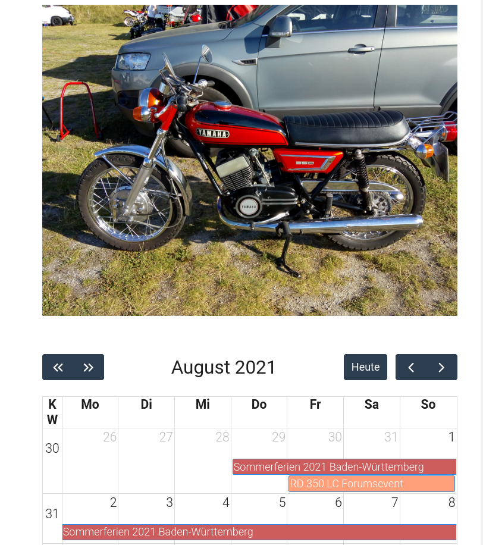

# Fullcalendar Plugin

The **Fullcalendar** Plugin is for [Grav CMS](http://github.com/getgrav/grav). It reads ICS Calendar Files and shows Events in a monthly Calendar Widget on your Page(s) - including Month Specific Images (if available in the calendar page folder):



## Installation

Installing the Fullcalendar plugin can be done in one of two ways. The GPM (Grav Package Manager) installation method enables you to quickly and easily install the plugin with a simple terminal command, while the manual method enables you to do so via a zip file.  
### GPM Installation (Preferred)

The simplest way to install this plugin is via the [Grav Package Manager (GPM)](http://learn.getgrav.org/advanced/grav-gpm) through your system's terminal (also called the command line).  From the root of your Grav install type:

    bin/gpm install fullcalendar

This will install the Fullcalendar plugin into your `/user/plugins` directory within Grav. Its files can be found under `/your/site/grav/user/plugins/fullcalendar`.  
### Manual Installation

To install this plugin, just download the zip version of this repository and unzip it under `/your/site/grav/user/plugins`. Then, rename the folder to `fullcalendar`. You can find these files on [GitHub](https://github.com/wernerjoss/grav-plugin-fullcalendar) or via [GetGrav.org](https://getgrav.org/downloads/plugins).  
You should now have all the plugin files under

    /your/site/grav/user/plugins/fullcalendar

> NOTE: This plugin is a modular component for [Grav](http://github.com/getgrav/grav) and requires the [Error](https://github.com/getgrav/grav-plugin-error), [Problems](https://github.com/getgrav/grav-plugin-problems) and [Shortcode Core](https://github.com/getgrav/grav-plugin-shortcode-core) Plugins to operate.  
### Admin Plugin

If you use the admin plugin, you can install directly through the admin plugin by browsing the `Plugins` tab and clicking on the `Add` button.  
## Configuration

Before configuring this plugin, you should copy the `user/plugins/fullcalendar/fullcalendar.yaml` to `user/config/plugins/fullcalendar.yaml` and only edit that copy.  
Note that if you use the admin plugin, the file with your configuration, named fullcalendar.yaml will be saved in the `user/config/plugins/` folder once the configuration is saved in the admin.  
There is also a simple UI in the admin Backend that provides basic customizations.  
Here is the default configuration and an explanation of available options:

```yaml

enabled: true
colors: "#3a87ad" # see additional Note on custom colors in the Changelog, be sure to use single or double quotes around list !
showlegend: false   # set to true to show calendar File Name(s) as Legend below grid
weekNumbers: false  # set to true to show Week Numbers
cors_api_url:   # leave this empty if you are not sure - included local CORS proxy will be evaluated automatically !
enableOnAllPages: false    # Formerly known as useCustomPageTemplate, a name that was not clear what it is really used for - better use page Frontmatter (see usage)
```

## Usage

Once installed and enabled, you can use this Plugin to parse ICS Calendar File(s) - these must be found in user/data/calendars e.g. like this:
```
user/data/calendars
├── events.ics
└── holidays.ics
```
and set as parameter in the Plugin shortcode (without Path !) and display Events from that Calendar(s) anywhere on your Site adding this:

    [fullcalendar icsfile="events.ics,holidays.ics,..."][/fullcalendar]

to the content of the appropriate page (note the double quotes " surrounding the file name - single quotes ' will not work !)  
This is the standard method, however, from Version 0.2.6, it is also possible to just drop .ics Calendar Files into your page folder:
```
user/pages
├── 01.home
├── 02.typography
└── 03.events
    ├── calendar.md
    ├── events.ics
    └── holidays.ics
```
These will be picked up automatically and used like those in user/data/calendars.  
In case you only use calendar files in the page folder, be sure to include an empty shortcut:  
` [fullcalendar][/fullcalendar]`
in your page content, otherwise it will not work !  
Instead of local Files, you can also provide absolute URL's to (remote) ICS Calendars, in which case a CORS proxy will be used to access them - see [this Document](ExternalCalendars.md) on how to use external Calendars.  
Also note, that from v 0.2.8, the Plugin is supposed to use the calendar.html.twig template from the plugin (or a modified copy in your Theme Folder) for the calendar page - this can be done manually or in the admin backend by choosing 'Calendar' in the dropdown for the page template.  
From v0.3.0, the Plugin can also be enabled on a per-page base via frontmatter: just set `fullcalendar: true` in the page header.  
This Option is useful in case the calendar.html.twig template cannot be used, e.g. for a calendar in a modular page or in a blog.  
Alternatively, there is still the Configuration Option useCustomPageTemplate (this Name is obsolete, as it led to confusion, new Name is now enableOnAllPages), which, if set to true, will enable the Plugin globally on each and every page.  
However, this is not recommendend, due to the heavy usage of javascript Librarys from fullcalendar.io - these will affect the whole site.  
For that reason, the useCustomPageTemplate/enableOnAllPages Flag is no more available in the Admin Backend (but still working if set manually in the config file).  
In short, the use of the Default page template is recommended for most use cases, as only this way, you will be able to use the monthly picture feature or the handy calendar page drop-in for ics files.  
As mentioned, you can also show a Picture for the current month above the calendar widget (see screenshot obove), if using the standard template.  
Just put 12 Image Files named 'January.jpg', 'February.jpg', ... , 'December.jpg' in the Folder for your Page where the Calendar will be placed.  
(Note that Image File names must match Month names according to your locale setting, so, for locale: de, use 'Januar.jpg' ...).  
Finally, it should be noted that this Plugin relies on jquery, which is loaded by most Themes - in case you are using a Theme that does not do this, jquery is now (from v 0.2.12) automatically loaded, no more config Option needed for that.  
## Advanced Usage
As an addition to the standard use case, there is an elegant way to automatically update your .ics Files from remote Calendars in case those are hosted on a CalDav Server (e.g. Owncloud, Nextcloud...):
In this case, you can just use [caldav2ics](https://github.com/wernerjoss/caldav2ics) via cron job or the [Grav Scheduler](https://learn.getgrav.org/17/advanced/scheduler) to automatically update your ics Files shown by the Fullcalendar Plugin, so that remote Calendar content, usually maintained in separate Calendar Apps (such as Google Calendar or Lightning) is automatically propagated to your Website.  
The same is true if you install [grav-plugin-caldav2ics](https://github.com/wernerjoss/grav-plugin-caldav2ics) which is fully integrated in Grav and has a nice Admin Backend for easy configuration (this will create a config File that can directly be used by caldav2ics).  
## CORS Issues:
As of Begin 2021, I realized, that the recommended external CORS Proxy (herokuapp) will no longer work for public use, see [this support Thread](https://github.com/Rob--W/cors-anywhere/issues/301).  
So I decided to implement a local CORS Proxy, which is available from v 0.2.8.  
For most use cases, the empty cors_api_url in the settings should be ok, as the included internal Proxy will be used, if required.  
Only in case you really prefer to use an external CORS Proxy, you will need to adapt this.  
Hint: the automatically evaluated CORS Proxy URL (created when cors_api_url is empty - so, when updating, be sure to delete the old herokuapp URL if present) is normally http://yourdomain/user/plugins/fullcalendar/proxy.php/ but will be evaluated automatically even if Grav is e.g. installed in Subdirectory grav (or else) !
## Timezone Issues:
This refers to [issue #44](https://github.com/wernerjoss/grav-plugin-fullcalendar/issues/44) which has recently come up and turned out to be a major mess with fullcalendar.io v4 (referred to fc4 in the following).  
Although having added the timezone-aware js Librarys from the fc4 packages, I could not find a way to automatically adjust for the diverse practical use cases/calendar incarnations.  
So I decided to implement some additional settings for the plugin, which can be used to correct for date/time shifts for single/recurring events (yes, it is unfortunately necessary to handle those separately, even w.r. to Daylight Saving Times).  
Anyone having issues with incorrectly displayed Events Times, can now fiddle with these settings until everything looks ok - see the Hints in the admin backend.  
Of course, this is not a really satisfactory Solution, I think the real cause is buried in some bugs of the fc4 release. Maybe (hopefully) the fc5 incarnations are better suited to this - porting this Plugin to fc5 is planned anyway, but will probably not happen in the near future.  
So, for the time beeing, I hope most users can live with the workarounds presented here from Plugin Version 0.3.0.

## Credits

This Plugin is built on [fullcalendar.io](https://fullcalendar.io), [jakubroztocil/rrule](https://github.com/jakubroztocil/rrule) and [jsical](http://mozilla-comm.github.io/ical.js) - Javascript parser for rfc5545

## To Do

* Implement EXDATE/EXRULE rrule exceptions
* Upgrade included Fullcalendar.io to Version 5 (currently: Version 4)
